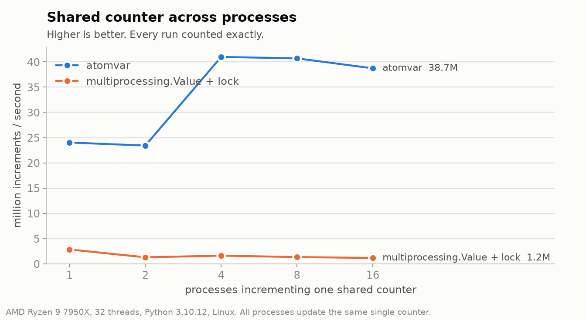
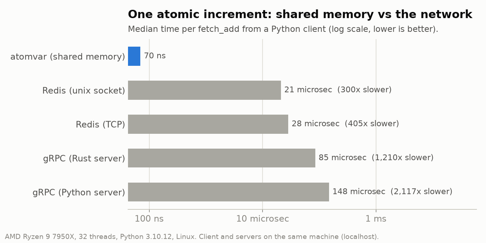

# Atomic-Variables

Lock-free atomic variables for Python, plus C, Go, Rust and anything else that can
call C. Many threads, processes, or programs in different languages can update one
shared counter or flag at the same time without losing updates and without locks.





Measured on an AMD Ryzen 9 7950X (Linux, Python 3.10). Full report:
[benches/results](benches/results/Slade201289-3-20261002-164330/report.md).

## Setup

Linux x86_64. Needs Python 3.9+ and [Rust](https://rustup.rs).

```bash
git clone https://github.com/AureliusNguyen/Distributed-Systems-Components.git
cd Distributed-Systems-Components/Atomic-Variables
python3 -m venv .venv && source .venv/bin/activate
pip install maturin
cd crates/atomvar-py && maturin develop --release && cd ../..
```

## Examples

**Threads**: a counter shared by threads.

```python
import threading
from atomvar import AtomicInt

hits = AtomicInt(0)

def work():
    for _ in range(100_000):
        hits.fetch_add(1)

threads = [threading.Thread(target=work) for _ in range(4)]
for t in threads: t.start()
for t in threads: t.join()
print(hits.get())  # 400000, every time
```

**Processes**: the same name in any process is the same variable.

```python
import multiprocessing as mp
from atomvar import Arena

def work(_):
    Arena("jobs").int("done").fetch_add(1)

if __name__ == "__main__":
    mp.set_start_method("spawn")
    with mp.Pool(8) as pool:
        pool.map(work, range(1000))
    print(Arena("jobs").int("done").get())  # 1000
```

**Claim a job exactly once**: only one process wins.

```python
from atomvar import Arena

owner = Arena("jobs").uint("job-42-owner")
if owner.compare_and_set(0, worker_id):  # worker_id: any nonzero id
    run_job_42()
```

**Other languages**: C, C++ and Go use `crates/atomvar-ffi/include/atomvar.h`
(see `examples/c_example.c`); Rust uses `atomvar-core`. All of them see the same
variables.

## Try the speed difference

```bash
python examples/Int.py      # normal int + threading.Lock
python examples/AtomInt.py  # AtomicInt
```

## More

- [docs/DESIGN.md](docs/DESIGN.md): guarantees, memory orderings, crash and fork
  behavior, the HTTP/gRPC/MCP server, build and test commands
- [benches/suite](benches/suite/README.md): reproduce the benchmarks
